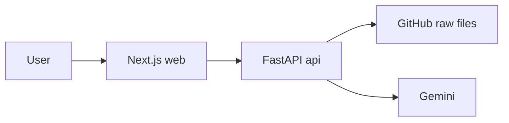

# Architecture

sol-audit-ai is an AI-assisted first-pass security review for Solana / Anchor programs. It loads a
program's Rust source, then explains it, audits it against a Solana-specific checklist, and answers
questions about it.

## Overview

The app is stateless — no database, no auth. The frontend loads a contract once, then passes its
source to each analysis call.

## Loading a contract

Two inputs (`POST /contract/load`):
- **Paste** Rust / Anchor source, or
- a **GitHub repo URL** — the backend reads the repo tree and fetches every `.rs` file (skipping
  `target/`), then concatenates them with file headers.

Deliberately **not** a deployed program address: on-chain there is only compiled bytecode, not
source, so a meaningful audit isn't possible from an address alone.

## Explain and audit — whole context

`POST /explain` and `POST /audit` send the whole program to Gemini. Feeding the entire program
(rather than retrieved chunks) matters here: many Solana bugs are cross-function — an account
validated in one handler but not another — so the model needs to see everything at once.

The audit is **grounded**: the prompt carries an explicit Solana / Anchor vulnerability checklist
(missing signer / owner checks, arbitrary CPI, integer overflow, PDA bump canonicalization,
`init_if_needed` misuse, account-closing / revival, Pyth staleness, …). This turns a generic
"ask an LLM" into a Solana-aware review, and the model is told not to invent findings where a check
actually holds. Output is a severity-ranked JSON report.

## Chat — retrieval (RAG)

`POST /chat` is where retrieval earns its place. Small programs are answered from the whole source;
for larger repos the source is chunked, embedded (Gemini, task-typed), and only the top matches for
the question are sent to the model. Chunk embeddings are cached by a hash of the source, so repeated
questions about the same contract don't re-embed.

## Honesty

Presented as an **AI-assisted first-pass review**, not a certified audit — an LLM can miss real
issues and raise false positives.

## Trade-offs & what's next

- Whole-context explain / audit is bounded by the model's context window; a very large program would
  need a map-reduce pass.
- Findings aren't verified against a compiler or analyzer — pairing the LLM with a static analyzer
  (an Anchor-aware linter) would cut false positives.
- No persistence — results aren't saved between sessions.
