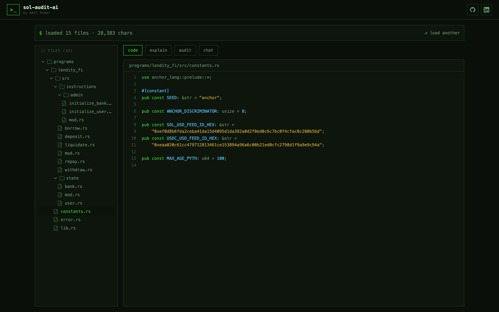
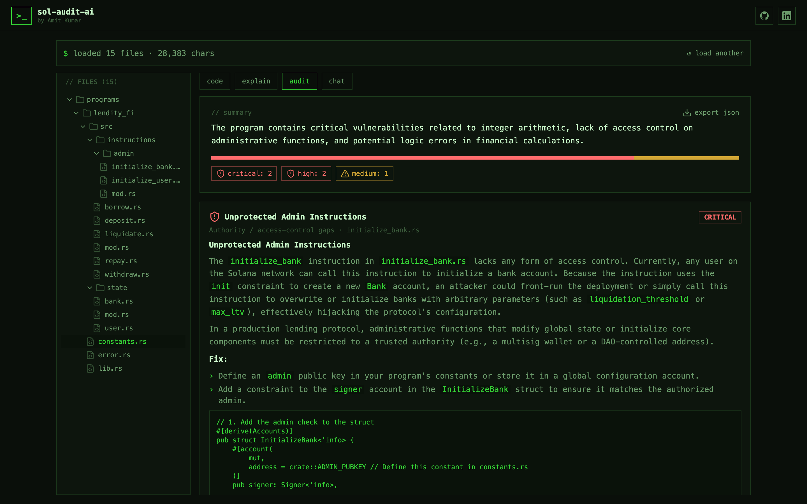
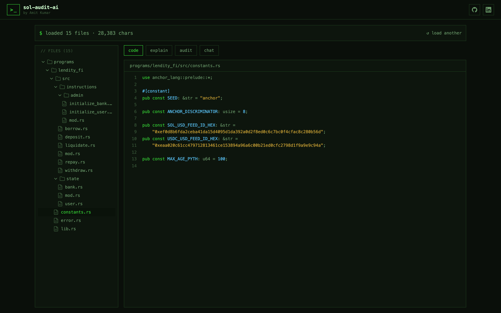
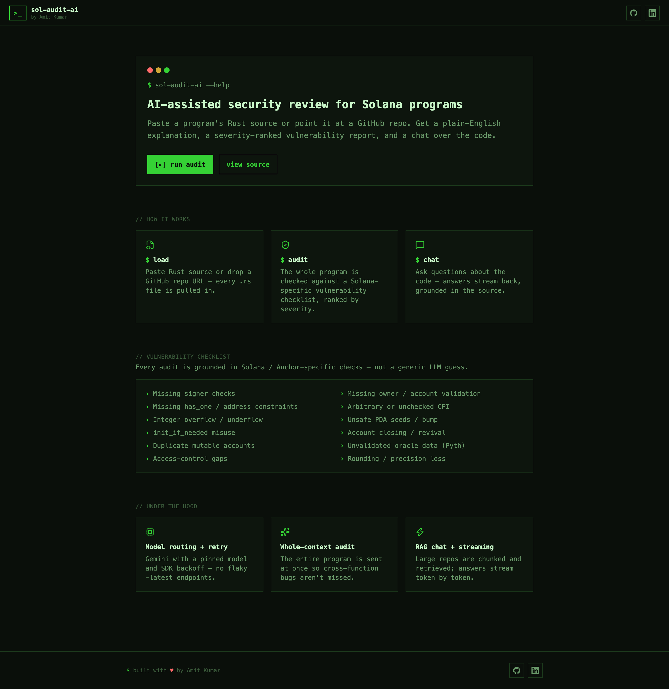

# sol-audit-ai

**Live demo → [sol-audit-ai.vercel.app](https://sol-audit-ai.vercel.app)**

An AI-assisted first-pass security review for Solana / Anchor programs. Paste a program's Rust
source or point it at a public GitHub repo, and get:

- a plain-English explanation of each instruction,
- a **severity-ranked vulnerability report** grounded in a Solana-specific checklist,
- a chat to ask questions about the code.



## Tech

| | |
|---|---|
| Frontend | Next.js, Tailwind — a dark terminal UI |
| Backend | FastAPI (Python) |
| AI | Google Gemini (explain, audit, chat) |

Explain and audit run over the whole program (better cross-function context); chat uses retrieval
(RAG) so larger repos stay in budget.

## Structure

```
.
├── web/    # Next.js frontend (terminal UI)
└── api/    # FastAPI backend
```

## Screenshots

The severity-ranked audit report — findings stream in one by one:



The code viewer with the file tree:



The landing — how it works and the Solana vulnerability checklist:



## Getting started

- **Local dev:** run the backend (see [`api/README.md`](./api/README.md)) and the frontend
  (`cd web && npm install && npm run dev`).
- **Architecture:** see [ARCHITECTURE.md](./ARCHITECTURE.md).
- **Deployment:** see [DEPLOY.md](./DEPLOY.md).
